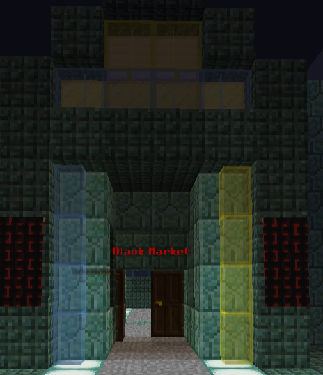
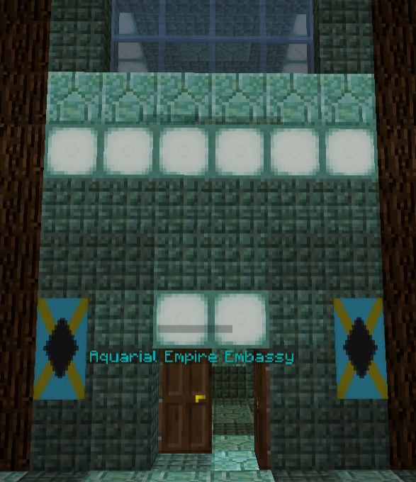

# Economy

## /ah - Open Auction House

Opens the auction house
**Usage:** `/ah`  

---
## /ah sell - Sell item in Auction House
Puts the item in your hand on the Auction house
**Usage:** `/ah sell <price> [count]`  

---
## /shop - Opens static shop

Opens the static shop
**Usage:** `/shop`  

---
## /sellgui - Open the Sell Gui

Sell most items here and get instantaneous money!
**Usage:** `/sellgui`  

---
## Areas

## The Sea City Black Market

## Aquarial Empire Embassy
